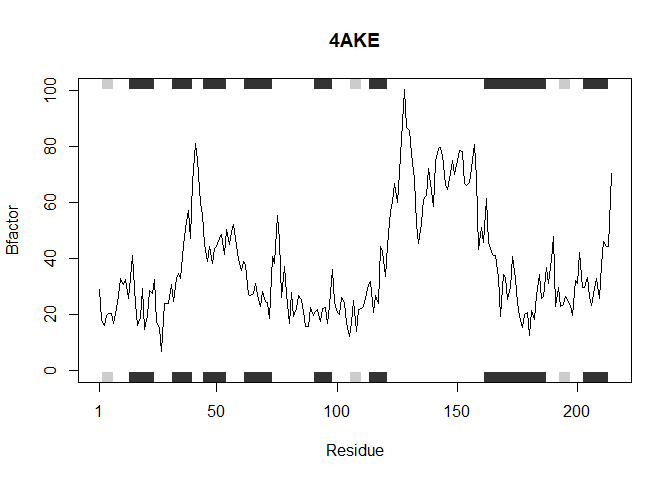
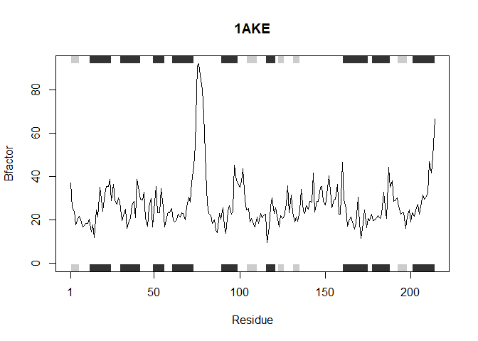

HW06
================
Ethan Ashley (PID: A15939817)
2025-10-17

- [Generalize the following protein analysis code to work for any
  protein
  sequence](#generalize-the-following-protein-analysis-code-to-work-for-any-protein-sequence)
  - [Q6. How would you generalize the original code above to work with
    any set of input protein
    structures?](#q6-how-would-you-generalize-the-original-code-above-to-work-with-any-set-of-input-protein-structures)
  - [Testing with `sapply()`](#testing-with-sapply)

# Generalize the following protein analysis code to work for any protein sequence

``` r
# Can you improve this analysis code?
library(bio3d)
s1 <- read.pdb("4AKE") # kinase with drug
```

    ##   Note: Accessing on-line PDB file

``` r
s2 <- read.pdb("1AKE") # kinase no drug
```

    ##   Note: Accessing on-line PDB file
    ##    PDB has ALT records, taking A only, rm.alt=TRUE

``` r
s3 <- read.pdb("1E4Y") # kinase with drug
```

    ##   Note: Accessing on-line PDB file

``` r
s1.chainA <- trim.pdb(s1, chain="A", elety="CA")
s2.chainA <- trim.pdb(s2, chain="A", elety="CA")
s3.chainA <- trim.pdb(s1, chain="A", elety="CA")

s1.b <- s1.chainA$atom$b
s2.b <- s2.chainA$atom$b
s3.b <- s3.chainA$atom$b

plotb3(s1.b, sse=s1.chainA, typ="l", ylab="Bfactor")
```

<!-- -->

``` r
plotb3(s2.b, sse=s2.chainA, typ="l", ylab="Bfactor")
```

<!-- -->

``` r
plotb3(s3.b, sse=s3.chainA, typ="l", ylab="Bfactor")
```

<!-- -->

## Q6. How would you generalize the original code above to work with any set of input protein structures?

Converting the general code above into a more generalized version

``` r
inputProteins = c("4AKE", "1AKE", "1E4Y")

#generating a for loop that takes a list of PDB protein ID's and analyzes each one individually as shown above

for (i in inputProteins) {
  s <- read.pdb(i)
  s.chainA <- trim.pdb(s, chain="A", elety="CA")
  s.b <- s.chainA$atom$b
  plotb3(s.b, sse=s.chainA, typ="l", ylab="Bfactor")
}
```

    ##   Note: Accessing on-line PDB file

    ## Warning in get.pdb(file, path = tempdir(), verbose = FALSE):
    ## C:\Users\eashl\AppData\Local\Temp\RtmpolJCYC/4AKE.pdb exists. Skipping download

<!-- -->

    ##   Note: Accessing on-line PDB file

    ## Warning in get.pdb(file, path = tempdir(), verbose = FALSE):
    ## C:\Users\eashl\AppData\Local\Temp\RtmpolJCYC/1AKE.pdb exists. Skipping download

    ##    PDB has ALT records, taking A only, rm.alt=TRUE

<!-- -->

    ##   Note: Accessing on-line PDB file

    ## Warning in get.pdb(file, path = tempdir(), verbose = FALSE):
    ## C:\Users\eashl\AppData\Local\Temp\RtmpolJCYC/1E4Y.pdb exists. Skipping download

<!-- -->

Converting the generalized code into a function that can be applied to
any list of sequences

``` r
#This function accepts a list of PDB protein ID's and analyzes each one individually as shown above. main is added as an input to plotb3 to clarify which protein is plotted.

analyzeProteins <- function(seqs) {
  for (i in inputProteins) {
    s <- read.pdb(i)
    s.chainA <- trim.pdb(s, chain="A", elety="CA")
    s.b <- s.chainA$atom$b
        plotb3(s.b, sse=s.chainA, typ="l", ylab="Bfactor", main=i)
  }
}
```

**This function accepts a list of PDB protein ID’s and analyzes each one
individually as shown above generating a plot of the residue position
vs. the B factor**

Testing new function on the provided list of sequences

``` r
analyzeProteins(inputProteins)
```

    ##   Note: Accessing on-line PDB file

    ## Warning in get.pdb(file, path = tempdir(), verbose = FALSE):
    ## C:\Users\eashl\AppData\Local\Temp\RtmpolJCYC/4AKE.pdb exists. Skipping download

<!-- -->

    ##   Note: Accessing on-line PDB file

    ## Warning in get.pdb(file, path = tempdir(), verbose = FALSE):
    ## C:\Users\eashl\AppData\Local\Temp\RtmpolJCYC/1AKE.pdb exists. Skipping download

    ##    PDB has ALT records, taking A only, rm.alt=TRUE

<!-- -->

    ##   Note: Accessing on-line PDB file

    ## Warning in get.pdb(file, path = tempdir(), verbose = FALSE):
    ## C:\Users\eashl\AppData\Local\Temp\RtmpolJCYC/1E4Y.pdb exists. Skipping download

<!-- -->

## Testing with `sapply()`

**Making the function even more generalized so that it can be utilized
with sapply(). It accepts a single PDB ID at a time but can be
vectorized with sapply() to achieve the same output as previously**

``` r
analyzeProteins <- function(seqs) {
    s <- read.pdb(i)
    s.chainA <- trim.pdb(s, chain="A", elety="CA")
    s.b <- s.chainA$atom$b
    plotb3(s.b, sse=s.chainA, typ="l", ylab="Bfactor", , main=i)
}
```

``` r
sapply(inputProteins, analyzeProteins)
```

    ##   Note: Accessing on-line PDB file

    ## Warning in get.pdb(file, path = tempdir(), verbose = FALSE):
    ## C:\Users\eashl\AppData\Local\Temp\RtmpolJCYC/1E4Y.pdb exists. Skipping download

<!-- -->

    ##   Note: Accessing on-line PDB file

    ## Warning in get.pdb(file, path = tempdir(), verbose = FALSE):
    ## C:\Users\eashl\AppData\Local\Temp\RtmpolJCYC/1E4Y.pdb exists. Skipping download

    ##   Note: Accessing on-line PDB file

    ## Warning in get.pdb(file, path = tempdir(), verbose = FALSE):
    ## C:\Users\eashl\AppData\Local\Temp\RtmpolJCYC/1E4Y.pdb exists. Skipping download

    ## $`4AKE`
    ## NULL
    ## 
    ## $`1AKE`
    ## NULL
    ## 
    ## $`1E4Y`
    ## NULL
