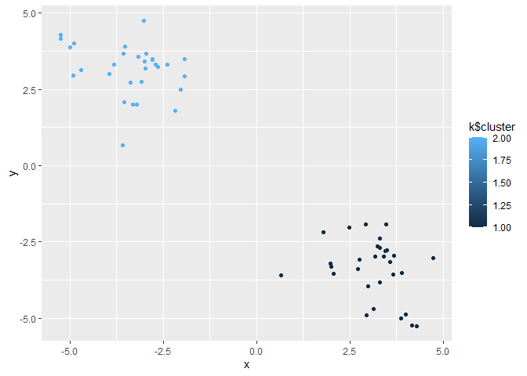

class07
================
Ethan Ashley (PID: A15939817)
2025-10-22

- [K-means Clustering](#k-means-clustering)
- [Hierarchical Clustering](#hierarchical-clustering)
- [Principal Component Analysis
  (PCA)](#principal-component-analysis-pca)

## K-means Clustering

Today we will begin exploring some “classical” machinge learning
approaches. We will start with clustering:

Let’s first make up some data to cluster where we know what the answer
should be.

``` r
#rnorm randomly picks n values around a normal distribution, unless specified it assumes mean = 0 and SD = 1
hist(rnorm(100))
```

<!-- -->

Let’s generate 30 points centered around +3 and -3

``` r
x <- c(rnorm(30, 3), rnorm(30, -3))
#y <- c(rnorm(30, 3), rnorm(30, -3))
y <- rev(x)

#can be used to compare two vectors side by side column-wise
z <- cbind(x,y) 

#visual inspection of our randomly generated data
plot(z)
```

<!-- -->

The main function in “base” R for K-means clustering is called
`kmeans()`.

``` r
#kmeans(matrix of data, centers = number of clusters to make)
k <- kmeans(z, 2)
k$cluster #returns the cluster vector of which points are assigned to which cluster
```

    ##  [1] 1 1 1 1 1 1 1 1 1 1 1 1 1 1 1 1 1 1 1 1 1 1 1 1 1 1 1 1 1 1 2 2 2 2 2 2 2 2
    ## [39] 2 2 2 2 2 2 2 2 2 2 2 2 2 2 2 2 2 2 2 2 2 2

> Q. Make a plot of our data colored by cluster assignment?

``` r
library(ggplot2)

ggplot(z) + aes(x, y, color=k$cluster) + geom_point()
```

<!-- -->

``` r
plot(z, col=k$cluster)
points(k$centers, col="blue", pch=15)
```

<!-- -->

> Q. Cluster with k-means into 4 clusters and plot your results as
> above.

``` r
k4 <- kmeans(z, 4)

plot(z, col=k4$cluster)
points(k4$centers, col="blue", pch=15)
```

<!-- -->

> Q. Run k-means with centers (i.e. values of k) from 1 to 6. Make a
> plot of the tot.withinss vs. cluster number

``` r
# store this value for each analysis k$tot.withinss

c <- 1:6
total <- NULL

for (i in c) {
  total <- c(total, kmeans(z, i)$tot.withinss)
}

plot(c, total, typ="o") #called a "Scree Plot", used to determine ideal # of groups with K-means clustering
```

<!-- -->

`This method imposes a structure on the data.`

## Hierarchical Clustering

The main funciton in “base” R for this is called `hclust()`. It peforms
bottom-up clustering, iteratively generating fewer clusters each time.

``` r
#uses a distance matrix instead of raw data like K-means clustering
#must apply dist() function to raw data

d <- dist(z)
hc <- hclust(d)
hc
```

    ## 
    ## Call:
    ## hclust(d = d)
    ## 
    ## Cluster method   : complete 
    ## Distance         : euclidean 
    ## Number of objects: 60

``` r
#produces a clustering "tree"
plot(hc)
abline(h=7, col="red")
```

<!-- --> Important
information in the dendrogram is conveyed by the location of the
horizontal bars.

To obtain clusters from our `hclust` result object **hc** we “cut” the
tree to yield different sub branches. For this we use the `cutree()`
function. This function yields a clustering vector like with k-means
clustering.

``` r
grps <- cutree(hc, k = 2)

plot(z, col=grps)
```

<!-- -->

## Principal Component Analysis (PCA)

Example data analysis on UK food data.

``` r
url <- "https://tinyurl.com/UK-foods"
x <- read.csv(url)
```

> Q1. How many rows and columns are in your new data frame named x? What
> R functions could you use to answer this questions?

``` r
dim(x)
```

    ## [1] 17  5

There are 17 rows and 5 columns in this dataset.

Fixing the row names issue

``` r
# Note how the minus indexing works
rownames(x) <- x[,1]
x <- x[,-1]
head(x)
```

    ##                England Wales Scotland N.Ireland
    ## Cheese             105   103      103        66
    ## Carcass_meat       245   227      242       267
    ## Other_meat         685   803      750       586
    ## Fish               147   160      122        93
    ## Fats_and_oils      193   235      184       209
    ## Sugars             156   175      147       139

> Q2. Which approach to solving the ‘row-names problem’ mentioned above
> do you prefer and why? Is one approach more robust than another under
> certain circumstances?

I think that specifying the row-names column while importing the data is
a preferable way to solve this issue. I think if the structure of the
data is known, which it is in this case, importing it in the form we
wish to work with it will be more efficient than importing the data and
re-formating afterwards. This is also more robust because you can avoid
accidentally delting additional columns from the matrix when the chunk
is run again.

``` r
x <- read.csv(url, row.names=1)
head(x)
```

    ##                England Wales Scotland N.Ireland
    ## Cheese             105   103      103        66
    ## Carcass_meat       245   227      242       267
    ## Other_meat         685   803      750       586
    ## Fish               147   160      122        93
    ## Fats_and_oils      193   235      184       209
    ## Sugars             156   175      147       139

``` r
# Using base R
barplot(as.matrix(x), beside=T, col=rainbow(nrow(x)))
```

<!-- -->

> Q3. Changing what optional argument in the above barplot() function
> results in the following plot?

Changing the value of beside from true to false changes the orientation
of our barplot.

``` r
# Using base R
barplot(as.matrix(x), beside=F, col=rainbow(nrow(x)))
```

<!-- -->

Reformatting our data to be optmizied for ggplot.

``` r
library(tidyr)

# Convert data to long format for ggplot with `pivot_longer()`
x_long <- x |> 
          tibble::rownames_to_column("Food") |> 
          pivot_longer(cols = -Food, 
                       names_to = "Country", 
                       values_to = "Consumption")

dim(x_long)
```

    ## [1] 68  3

Making a plot with ggplot of the re-organized data.

``` r
# Create grouped bar plot
library(ggplot2)

ggplot(x_long) +
  aes(x = Country, y = Consumption, fill = Food) +
  geom_col(position = "dodge") +
  theme_bw()
```

<!-- -->

> Q4. Changing what optional argument in the above ggplot() code results
> in a stacked barplot figure?

Changing the position input in `geom_col` to “stack” changes the
orientaiton of the bar plot

``` r
ggplot(x_long) +
  aes(x = Country, y = Consumption, fill = Food) +
  geom_col(position = "stack") +
  theme_bw()
```

<!-- -->

> Q5. We can use the pairs() function to generate all pairwise plots for
> our countries. Can you make sense of the following code and resulting
> figure? What does it mean if a given point lies on the diagonal for a
> given plot?

It shows how similar the consumption of different food items is between
two countries. Points on the diagonal line are more similar to each
other, while those farther away are less similar (i.e., one is greater
than another).

``` r
pairs(x, col=rainbow(nrow(x)), pch=16)
```

<!-- -->

``` r
library(pheatmap)

pheatmap( as.matrix(x) )
```

<!-- -->

> Q6. Based on the pairs and heatmap figures, which countries cluster
> together and what does this suggest about their food consumption
> patterns? Can you easily tell what the main differences between N.
> Ireland and the other countries of the UK in terms of this data-set?

England, Wales, and Scotland appear to cluster together while Northern
Ireland is in its own cluster.

``` r
# Use the prcomp() PCA function 
pca <- prcomp( t(x) )
summary(pca)
```

    ## Importance of components:
    ##                             PC1      PC2      PC3       PC4
    ## Standard deviation     324.1502 212.7478 73.87622 3.176e-14
    ## Proportion of Variance   0.6744   0.2905  0.03503 0.000e+00
    ## Cumulative Proportion    0.6744   0.9650  1.00000 1.000e+00

> Q7. Complete the code below to generate a plot of PC1 vs PC2. The
> second line adds text labels over the data points.

``` r
# Create a data frame for plotting
df <- as.data.frame(pca$x)
df$Country <- rownames(df)

# Plot PC1 vs PC2 with ggplot
ggplot(pca$x) +
  aes(x = PC1, y = PC2, label = rownames(pca$x)) +
  geom_point(size = 3) +
  geom_text(vjust = -0.5) +
  xlim(-270, 500) +
  xlab("PC1") +
  ylab("PC2") +
  theme_bw()
```

<!-- -->

> Q8. Customize your plot so that the colors of the country names match
> the colors in our UK and Ireland map and table at start of this
> document.

``` r
# Plot PC1 vs PC2 with ggplot
ggplot(pca$x) +
  aes(x = PC1, y = PC2, label = rownames(pca$x)) +
  geom_point(size = 3) +
  geom_text(vjust = -0.5, col=c("yellow", "red", "blue", "green")) +
  xlim(-270, 500) +
  xlab("PC1") +
  ylab("PC2") +
  theme_bw()
```

<!-- -->

This calculation accoutns for how much of the variation in the data each
PC accounts for

``` r
v <- round( pca$sdev^2/sum(pca$sdev^2) * 100 )
v
```

    ## [1] 67 29  4  0

``` r
## or the second row here...
z <- summary(pca)
z$importance
```

    ##                              PC1       PC2      PC3          PC4
    ## Standard deviation     324.15019 212.74780 73.87622 3.175833e-14
    ## Proportion of Variance   0.67444   0.29052  0.03503 0.000000e+00
    ## Cumulative Proportion    0.67444   0.96497  1.00000 1.000000e+00

``` r
# Create scree plot with ggplot
variance_df <- data.frame(
  PC = factor(paste0("PC", 1:length(v)), levels = paste0("PC", 1:length(v))),
  Variance = v
)

ggplot(variance_df) +
  aes(x = PC, y = Variance) +
  geom_col(fill = "steelblue") +
  xlab("Principal Component") +
  ylab("Percent Variation") +
  theme_bw() +
  theme(axis.text.x = element_text(angle = 0))
```

<!-- --> Another major
result of PCA is the so-called “variable loadings” or `$rotation` that
tells us how each of the original variables (i.e., foods) contributes to
our new axes (i.e., the PCs).

``` r
## Lets focus on PC1 as it accounts for > 90% of variance 
ggplot(pca$rotation) +
  aes(x = PC1, 
      y = reorder(rownames(pca$rotation), PC1)) +
  geom_col(fill = "steelblue") +
  xlab("PC1 Loading Score") +
  ylab("") +
  theme_bw() +
  theme(axis.text.y = element_text(size = 9))
```

<!-- -->

> Q9. Generate a similar ‘loadings plot’ for PC2. What two food groups
> feature prominantely and what does PC2 mainly tell us about?

Soft drinks and fresh potatoes feature most prominently in this loading
plot. It tells us which variables are driving the most variation away
from the best fit line described by PC1 within each cluster.

``` r
ggplot(pca$rotation) +
  aes(x = PC2, 
      y = reorder(rownames(pca$rotation), PC2)) +
  geom_col(fill = "steelblue") +
  xlab("PC2 Loading Score") +
  ylab("") +
  theme_bw() +
  theme(axis.text.y = element_text(size = 9))
```

<!-- -->
