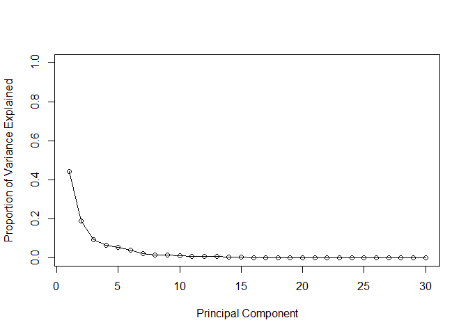

Class 08: Breast Cancer Analysis Project
================
Ethan Ashley (PID: A15939817)
2025-10-24

- [Background](#background)
- [Data Import](#data-import)
- [Exploratory Data Analysis](#exploratory-data-analysis)
- [Principal Component Analysis](#principal-component-analysis)
  - [Interpreting PCA results](#interpreting-pca-results)
  - [Variance Explained](#variance-explained)
- [Hierarchical Clustering](#hierarchical-clustering)
  - [Using Different Methods](#using-different-methods)
- [Combining Methods](#combining-methods)
- [Prediction](#prediction)

# Background

The goal of this mini-project is for you to explore a complete analysis
using the unsupervised learning techniques covered in class. We will
extend what we’ve learned by combining PCA as a preprocessing step to
clustering using data that consist of measurements of cell nuclei of
human breast masses. This expands on our RNA-Seq analysis from last day.

The data itself comes from the Wisconsin Breast Cancer Diagnostic Data
Set first reported by K. P. Benne and O. L. Mangasarian: “Robust Linear
Programming Discrimination of Two Linearly Inseparable Sets”.

Values in this data set describe characteristics of the cell nuclei
present in digitized images of a fine needle aspiration (FNA) of a
breast mass.

# Data Import

Importing the Wisconsin Cancer data set. Make sure not to include the
patient IDs or the pathologists diagnoses in the data that we analyze
below.

``` r
fna.data <- "WisconsinCancer.csv"

wisc.df <- read.csv(fna.data, row.names = 1)

# We can use -1 here to remove the first column containing the pathologist classifications
diagnosis <- wisc.df$diagnosis
wisc.data <- wisc.df[,-1]
wisc.data <- wisc.data[,-31]
```

# Exploratory Data Analysis

**Q1. How many observations are in this dataset?**

There are 569 observations in the dataset.

``` r
nrow(wisc.data)
```

    ## [1] 569

**Q2. How many of the observations have a malignant diagnosis?**

There are 212 twelve observations with a malignant diagnosis.

``` r
sum(diagnosis == "M")
```

    ## [1] 212

``` r
table(wisc.df$diagnosis) #alternative method shown in class
```

    ## 
    ##   B   M 
    ## 357 212

\*\*Q3. How many variables/features in the data are suffixed with
\_mean?\*\*

There are 10 variables in the data that are suffixed with \_mean.

``` r
length(grep("_mean", colnames(wisc.data)))
```

    ## [1] 10

# Principal Component Analysis

The main function in base R for PCA is `prcomp()`. It has optional
inputs scale and center.

In general we want to scale and center our data prior to PCA to ensure
that each feature contributes equally to the analysis, preventing
variables with larger scales from dominating the principal components.

``` r
# Check column means and standard deviations
colMeans(wisc.data)
```

    ##             radius_mean            texture_mean          perimeter_mean 
    ##            1.412729e+01            1.928965e+01            9.196903e+01 
    ##               area_mean         smoothness_mean        compactness_mean 
    ##            6.548891e+02            9.636028e-02            1.043410e-01 
    ##          concavity_mean     concave.points_mean           symmetry_mean 
    ##            8.879932e-02            4.891915e-02            1.811619e-01 
    ##  fractal_dimension_mean               radius_se              texture_se 
    ##            6.279761e-02            4.051721e-01            1.216853e+00 
    ##            perimeter_se                 area_se           smoothness_se 
    ##            2.866059e+00            4.033708e+01            7.040979e-03 
    ##          compactness_se            concavity_se       concave.points_se 
    ##            2.547814e-02            3.189372e-02            1.179614e-02 
    ##             symmetry_se    fractal_dimension_se            radius_worst 
    ##            2.054230e-02            3.794904e-03            1.626919e+01 
    ##           texture_worst         perimeter_worst              area_worst 
    ##            2.567722e+01            1.072612e+02            8.805831e+02 
    ##        smoothness_worst       compactness_worst         concavity_worst 
    ##            1.323686e-01            2.542650e-01            2.721885e-01 
    ##    concave.points_worst          symmetry_worst fractal_dimension_worst 
    ##            1.146062e-01            2.900756e-01            8.394582e-02

``` r
apply(wisc.data,2,sd)
```

    ##             radius_mean            texture_mean          perimeter_mean 
    ##            3.524049e+00            4.301036e+00            2.429898e+01 
    ##               area_mean         smoothness_mean        compactness_mean 
    ##            3.519141e+02            1.406413e-02            5.281276e-02 
    ##          concavity_mean     concave.points_mean           symmetry_mean 
    ##            7.971981e-02            3.880284e-02            2.741428e-02 
    ##  fractal_dimension_mean               radius_se              texture_se 
    ##            7.060363e-03            2.773127e-01            5.516484e-01 
    ##            perimeter_se                 area_se           smoothness_se 
    ##            2.021855e+00            4.549101e+01            3.002518e-03 
    ##          compactness_se            concavity_se       concave.points_se 
    ##            1.790818e-02            3.018606e-02            6.170285e-03 
    ##             symmetry_se    fractal_dimension_se            radius_worst 
    ##            8.266372e-03            2.646071e-03            4.833242e+00 
    ##           texture_worst         perimeter_worst              area_worst 
    ##            6.146258e+00            3.360254e+01            5.693570e+02 
    ##        smoothness_worst       compactness_worst         concavity_worst 
    ##            2.283243e-02            1.573365e-01            2.086243e-01 
    ##    concave.points_worst          symmetry_worst fractal_dimension_worst 
    ##            6.573234e-02            6.186747e-02            1.806127e-02

Scaling and centering is advisable with this dataset.

``` r
# Perform PCA on wisc.data by completing the following code
wisc.pr <- prcomp(wisc.data, scale. = TRUE)
```

**Q4. From your results, what proportion of the original variance is
captured by the first principal components (PC1)?**

44.27% of the original variance is accounted for by PC1.

**Q5. How many principal components (PCs) are required to describe at
least 70% of the original variance in the data?**

3 PCs are required to describe at least 70% of the original variance in
the dataset.

**Q6. How many principal components (PCs) are required to describe at
least 90% of the original variance in the data?**

7 PCs are required to describe at least 90% of the original variance in
the dataset.

``` r
summary(wisc.pr)
```

    ## Importance of components:
    ##                           PC1    PC2     PC3     PC4     PC5     PC6     PC7
    ## Standard deviation     3.6444 2.3857 1.67867 1.40735 1.28403 1.09880 0.82172
    ## Proportion of Variance 0.4427 0.1897 0.09393 0.06602 0.05496 0.04025 0.02251
    ## Cumulative Proportion  0.4427 0.6324 0.72636 0.79239 0.84734 0.88759 0.91010
    ##                            PC8    PC9    PC10   PC11    PC12    PC13    PC14
    ## Standard deviation     0.69037 0.6457 0.59219 0.5421 0.51104 0.49128 0.39624
    ## Proportion of Variance 0.01589 0.0139 0.01169 0.0098 0.00871 0.00805 0.00523
    ## Cumulative Proportion  0.92598 0.9399 0.95157 0.9614 0.97007 0.97812 0.98335
    ##                           PC15    PC16    PC17    PC18    PC19    PC20   PC21
    ## Standard deviation     0.30681 0.28260 0.24372 0.22939 0.22244 0.17652 0.1731
    ## Proportion of Variance 0.00314 0.00266 0.00198 0.00175 0.00165 0.00104 0.0010
    ## Cumulative Proportion  0.98649 0.98915 0.99113 0.99288 0.99453 0.99557 0.9966
    ##                           PC22    PC23   PC24    PC25    PC26    PC27    PC28
    ## Standard deviation     0.16565 0.15602 0.1344 0.12442 0.09043 0.08307 0.03987
    ## Proportion of Variance 0.00091 0.00081 0.0006 0.00052 0.00027 0.00023 0.00005
    ## Cumulative Proportion  0.99749 0.99830 0.9989 0.99942 0.99969 0.99992 0.99997
    ##                           PC29    PC30
    ## Standard deviation     0.02736 0.01153
    ## Proportion of Variance 0.00002 0.00000
    ## Cumulative Proportion  1.00000 1.00000

## Interpreting PCA results

**Q7. What stands out to you about this plot? Is it easy or difficult to
understand? Why?**

This plot is very messy and difficult to read. It is not possible to
tell which points come from which diagnosis group.

``` r
biplot(wisc.pr)
```

<!-- -->

Let’s make our main results figure - the “PC plot” or “score plot”.

``` r
library(ggplot2)

ggplot(wisc.pr$x) + aes(PC1, PC2, color = diagnosis) + geom_point()
```

<!-- -->

**Q8. Generate a similar plot for principal components 1 and 3. What do
you notice about these plots?**

There is still good clustering of the benign and malignant tumors. Since
PC3 explains less of the variance than PC2, it doesn’t do quite as good
of a job of separating the two groups.

``` r
ggplot(wisc.pr$x) + aes(PC1, PC3, color = diagnosis) + geom_point()
```

<!-- -->

## Variance Explained

``` r
# Calculate variance of each component
pr.var <- wisc.pr$sdev^2
head(pr.var)
```

    ## [1] 13.281608  5.691355  2.817949  1.980640  1.648731  1.207357

``` r
# Variance explained by each principal component: pve
pve <- pr.var / sum(pr.var)

# Plot variance explained for each principal component
plot(pve, xlab = "Principal Component", 
     ylab = "Proportion of Variance Explained", 
     ylim = c(0, 1), type = "o")
```

<!-- -->

**Q9. For the first principal component, what is the component of the
loading vector (i.e. wisc.pr\$rotation\[,1\]) for the feature
concave.points_mean? This tells us how much this original feature
contributes to the first PC.**

The component of the loading vector for PC1 for the feature
concave.points_mean is -0.26085376.

``` r
wisc.pr$rotation[,1]
```

    ##             radius_mean            texture_mean          perimeter_mean 
    ##             -0.21890244             -0.10372458             -0.22753729 
    ##               area_mean         smoothness_mean        compactness_mean 
    ##             -0.22099499             -0.14258969             -0.23928535 
    ##          concavity_mean     concave.points_mean           symmetry_mean 
    ##             -0.25840048             -0.26085376             -0.13816696 
    ##  fractal_dimension_mean               radius_se              texture_se 
    ##             -0.06436335             -0.20597878             -0.01742803 
    ##            perimeter_se                 area_se           smoothness_se 
    ##             -0.21132592             -0.20286964             -0.01453145 
    ##          compactness_se            concavity_se       concave.points_se 
    ##             -0.17039345             -0.15358979             -0.18341740 
    ##             symmetry_se    fractal_dimension_se            radius_worst 
    ##             -0.04249842             -0.10256832             -0.22799663 
    ##           texture_worst         perimeter_worst              area_worst 
    ##             -0.10446933             -0.23663968             -0.22487053 
    ##        smoothness_worst       compactness_worst         concavity_worst 
    ##             -0.12795256             -0.21009588             -0.22876753 
    ##    concave.points_worst          symmetry_worst fractal_dimension_worst 
    ##             -0.25088597             -0.12290456             -0.13178394

# Hierarchical Clustering

``` r
# Scale the wisc.data data using the "scale()" function
data.scaled <- scale(wisc.data)
```

``` r
data.dist <- dist(data.scaled)
```

``` r
wisc.hclust <- hclust(data.dist, method="complete")
```

**Q10. Using the plot() and abline() functions, what is the height at
which the clustering model has 4 clusters?**

A height of 19 appears to lead to 4 clusters.

``` r
plot(wisc.hclust)
abline(h=19, col="red", lty=2)
```

<!-- -->

## Using Different Methods

**Q12. Which method gives your favorite results for the same data.dist
dataset? Explain your reasoning.**

The method ward.D2 produces my favorite results for the data.dist. It is
the easiest of the various options to tell where branches of clusters
form.

``` r
wisc.hclust <- hclust(data.dist, method="ward.D2")

plot(wisc.hclust)
```

<!-- -->

# Combining Methods

``` r
wisc.pr.hclust <- hclust(dist(wisc.pr$x[,1:7]), method="ward.D2")

plot(wisc.pr.hclust)
```

<!-- -->

``` r
grps <- cutree(wisc.pr.hclust, h=70)
table(grps)
```

    ## grps
    ##   1   2 
    ## 216 353

``` r
table(grps, diagnosis)
```

    ##     diagnosis
    ## grps   B   M
    ##    1  28 188
    ##    2 329  24

``` r
plot(wisc.pr$x[,1:2], col=grps)
```

<!-- --> There are 188
true positives and 28 false positives in the malignant group. There are
329 true positives and 24 false positives in the benign group.

``` r
g <- as.factor(grps)
levels(g)
```

    ## [1] "1" "2"

``` r
g <- relevel(g,2)
levels(g)
```

    ## [1] "2" "1"

``` r
# Plot using our re-ordered factor 
plot(wisc.pr$x[,1:2], col=g)
```

<!-- -->

``` r
library(rgl)
plot3d(wisc.pr$x[,1:3], xlab="PC 1", ylab="PC 2", zlab="PC 3", cex=1.5, size=1, type="s", col=grps)
```

**Q13. How well does the newly created model with four clusters separate
out the two diagnoses?**

In general, the newly created model is fairly accurate. However, in a
clinical setting, the false negatives and positives would not be
desirable.

``` r
## Use the distance along the first 7 PCs for clustering i.e. wisc.pr$x[, 1:7]
wisc.pr.hclust <- hclust(dist(wisc.pr$x[, 1:7]), method="ward.D2")

wisc.pr.hclust.clusters <- cutree(wisc.pr.hclust, k=2)

table(wisc.pr.hclust.clusters, diagnosis)
```

    ##                        diagnosis
    ## wisc.pr.hclust.clusters   B   M
    ##                       1  28 188
    ##                       2 329  24

**Q14. How well do the hierarchical clustering models you created in
previous sections (i.e. before PCA) do in terms of separating the
diagnoses? Again, use the table() function to compare the output of each
model (wisc.km\$cluster and wisc.hclust.clusters) with the vector
containing the actual diagnoses.**

These other methods appear to do a fairly good job of classifying the
data.

``` r
wisc.km <- kmeans(wisc.data, 2)

table(wisc.km$cluster, diagnosis)
```

    ##    diagnosis
    ##       B   M
    ##   1 356  82
    ##   2   1 130

``` r
wisc.hclust.clusters <- cutree(wisc.hclust, k=2)

table(wisc.hclust.clusters, diagnosis)
```

    ##                     diagnosis
    ## wisc.hclust.clusters   B   M
    ##                    1  20 164
    ##                    2 337  48

# Prediction

``` r
#url <- "new_samples.csv"
url <- "https://tinyurl.com/new-samples-CSV"
new <- read.csv(url)
npc <- predict(wisc.pr, newdata=new)

plot(wisc.pr$x[,1:2], col=g)
points(npc[,1], npc[,2], col="blue", pch=16, cex=3)
text(npc[,1], npc[,2], c(1,2), col="white")
```

<!-- -->

**Q16. Which of these new patients should we prioritize for follow up
based on your results?**

I think we should prioritize patient 2 as they fall into the malignant
tumor group.
