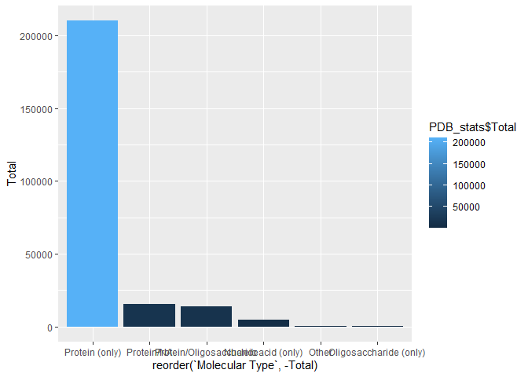
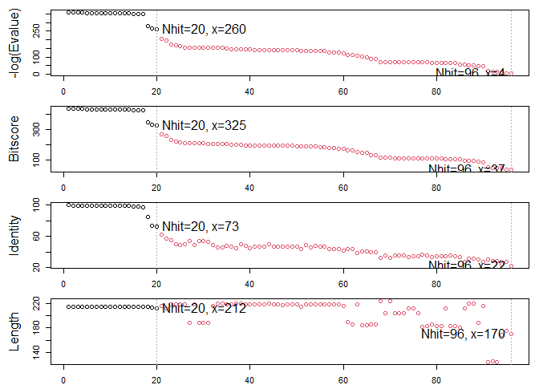

lab09
================
Ethan Ashley (PID: A15939817)
2025-10-29

- [Introduction to PDB](#introduction-to-pdb)
- [Visualizing structure data with the Mol\*
  viewer](#visualizing-structure-data-with-the-mol-viewer)
- [Bio3D package for structural
  bioinformatics](#bio3d-package-for-structural-bioinformatics)
- [Play with 3D viewing in R](#play-with-3d-viewing-in-r)
- [Comparative Analysis of Protein
  Structures](#comparative-analysis-of-protein-structures)

# Introduction to PDB

Importing the PDB statistics data file.

``` r
#Installing the 'READR' Package
library(readr)
```

``` r
#import data and convert into integer format for numeric operations
PDB_stats <- read_csv("Data Export Summary.csv")
```

    ## Rows: 6 Columns: 9
    ## ── Column specification ────────────────────────────────────────────────────────
    ## Delimiter: ","
    ## chr (1): Molecular Type
    ## dbl (4): Integrative, Multiple methods, Neutron, Other
    ## num (4): X-ray, EM, NMR, Total
    ## 
    ## ℹ Use `spec()` to retrieve the full column specification for this data.
    ## ℹ Specify the column types or set `show_col_types = FALSE` to quiet this message.

``` r
#PDB_stats <- read.csv("Data Export Summary.csv", row.names = 1)
#PDB_stats <- lapply(PDB_stats, gsub, pattern = ',', replacement = '')
#PDB_stats <- lapply(PDB_stats, as.integer)
```

**Q1: What percentage of structures in the PDB are solved by X-Ray and
Electron Microscopy.**

81.4% of the structures in the PDB are solved by X-ray 12.3% of the
strucutres in the PDB are solved by electron microscopy.

``` r
total_xray <- sum(PDB_stats$`X-ray`)
total_EM <- sum(PDB_stats$EM)
total_entries <- sum(PDB_stats$Total)

total_xray/total_entries
```

    ## [1] 0.8143231

``` r
total_EM/total_entries
```

    ## [1] 0.1227148

**Q2: What proportion of structures in the PDB are protein?**

86.0% of the structures in the PDB are protein.

``` r
PDB_stats$Total[1]/sum(PDB_stats$Total)
```

    ## [1] 0.860465

**Q3: Type HIV in the PDB website search box on the home page and
determine how many HIV-1 protease structures are in the current PDB?**

**Q3: Make a bar plot overview of Molecular type**

``` r
library(ggplot2)

ggplot(PDB_stats) + aes(reorder(`Molecular Type`, -Total), Total, fill=PDB_stats$Total) + geom_col()
```

<!-- -->

``` r
#ggplot(PDB_stats) + aes(reorder(`Molecular Type`, -Total), Total) + geom_bar(stat = "identity", position="stack")
```

# Visualizing structure data with the Mol\* viewer

The Mol\* viewer is embeded in the website of many bioinformatics
websites, like PDB

We will use it on the <https://molstar.org/> website

Let’s look at the x-ray crystal structure of the HIV-1 protease bound
with the drug indinavir (PDB ID: 1HSG)

Figures or images can be inserted using markdown format.


Updated image of the protease with the spacefill model representation of
the drug


**Q4: Water molecules normally have 3 atoms. Why do we see just one atom
per water molecule in this structure?**

We chose to display the water molecules in a way that is less obtrusive
when observing the rest of the structure.

**Q5: There is a critical “conserved” water molecule in the binding
site. Can you identify this water molecule? What residue number does
this water molecule have**

This water molecule has residue number 308.

**Q6: Generate and save a figure clearly showing the two distinct chains
of HIV-protease along with the ligand. You might also consider showing
the catalytic residues ASP 25 in each chain and the critical water (we
recommend “Ball & Stick” for these side-chains). Add this figure to your
Quarto document.**


# Bio3D package for structural bioinformatics

We can use the bio3d package to read and analyze biomolecular data in R.

``` r
library(bio3d)

hiv <- read.pdb("1HSG")
```

    ##   Note: Accessing on-line PDB file

``` r
hiv
```

    ## 
    ##  Call:  read.pdb(file = "1HSG")
    ## 
    ##    Total Models#: 1
    ##      Total Atoms#: 1686,  XYZs#: 5058  Chains#: 2  (values: A B)
    ## 
    ##      Protein Atoms#: 1514  (residues/Calpha atoms#: 198)
    ##      Nucleic acid Atoms#: 0  (residues/phosphate atoms#: 0)
    ## 
    ##      Non-protein/nucleic Atoms#: 172  (residues: 128)
    ##      Non-protein/nucleic resid values: [ HOH (127), MK1 (1) ]
    ## 
    ##    Protein sequence:
    ##       PQITLWQRPLVTIKIGGQLKEALLDTGADDTVLEEMSLPGRWKPKMIGGIGGFIKVRQYD
    ##       QILIEICGHKAIGTVLVGPTPVNIIGRNLLTQIGCTLNFPQITLWQRPLVTIKIGGQLKE
    ##       ALLDTGADDTVLEEMSLPGRWKPKMIGGIGGFIKVRQYDQILIEICGHKAIGTVLVGPTP
    ##       VNIIGRNLLTQIGCTLNF
    ## 
    ## + attr: atom, xyz, seqres, helix, sheet,
    ##         calpha, remark, call

**Q7: How many amino acid residues are there in this pdb object?**

There are 128 residues in this pdb object

**Q8: Name one of the two non-protein residues?**

HOH

**Q9: How many protein chains are in this structure? **

2, chains A and B.

Let’s get the sequence

``` r
pdbseq(hiv)
```

    ##   1   2   3   4   5   6   7   8   9  10  11  12  13  14  15  16  17  18  19  20 
    ## "P" "Q" "I" "T" "L" "W" "Q" "R" "P" "L" "V" "T" "I" "K" "I" "G" "G" "Q" "L" "K" 
    ##  21  22  23  24  25  26  27  28  29  30  31  32  33  34  35  36  37  38  39  40 
    ## "E" "A" "L" "L" "D" "T" "G" "A" "D" "D" "T" "V" "L" "E" "E" "M" "S" "L" "P" "G" 
    ##  41  42  43  44  45  46  47  48  49  50  51  52  53  54  55  56  57  58  59  60 
    ## "R" "W" "K" "P" "K" "M" "I" "G" "G" "I" "G" "G" "F" "I" "K" "V" "R" "Q" "Y" "D" 
    ##  61  62  63  64  65  66  67  68  69  70  71  72  73  74  75  76  77  78  79  80 
    ## "Q" "I" "L" "I" "E" "I" "C" "G" "H" "K" "A" "I" "G" "T" "V" "L" "V" "G" "P" "T" 
    ##  81  82  83  84  85  86  87  88  89  90  91  92  93  94  95  96  97  98  99   1 
    ## "P" "V" "N" "I" "I" "G" "R" "N" "L" "L" "T" "Q" "I" "G" "C" "T" "L" "N" "F" "P" 
    ##   2   3   4   5   6   7   8   9  10  11  12  13  14  15  16  17  18  19  20  21 
    ## "Q" "I" "T" "L" "W" "Q" "R" "P" "L" "V" "T" "I" "K" "I" "G" "G" "Q" "L" "K" "E" 
    ##  22  23  24  25  26  27  28  29  30  31  32  33  34  35  36  37  38  39  40  41 
    ## "A" "L" "L" "D" "T" "G" "A" "D" "D" "T" "V" "L" "E" "E" "M" "S" "L" "P" "G" "R" 
    ##  42  43  44  45  46  47  48  49  50  51  52  53  54  55  56  57  58  59  60  61 
    ## "W" "K" "P" "K" "M" "I" "G" "G" "I" "G" "G" "F" "I" "K" "V" "R" "Q" "Y" "D" "Q" 
    ##  62  63  64  65  66  67  68  69  70  71  72  73  74  75  76  77  78  79  80  81 
    ## "I" "L" "I" "E" "I" "C" "G" "H" "K" "A" "I" "G" "T" "V" "L" "V" "G" "P" "T" "P" 
    ##  82  83  84  85  86  87  88  89  90  91  92  93  94  95  96  97  98  99 
    ## "V" "N" "I" "I" "G" "R" "N" "L" "L" "T" "Q" "I" "G" "C" "T" "L" "N" "F"

Let’s trim to chain A and get just it’s sequence:

``` r
chainA <- trim.pdb(hiv, chain = "A")
chainA.seq <- pdbseq(chainA)
```

Let’s blast

``` r
#These results will be cached so that it does not re-do the blast search every time

blast <- blast.pdb(chainA.seq)
```

    ##  Searching ... please wait (updates every 5 seconds) RID = K6TGBU2E014 
    ##  ...
    ##  Reporting 249 hits

Plot a quick overview of blast results

``` r
hits <- plot(blast)
```

    ##   * Possible cutoff values:    123 110 69 -2 
    ##             Yielding Nhits:    224 238 244 249 
    ## 
    ##   * Chosen cutoff value of:    69 
    ##             Yielding Nhits:    244

<!-- --> \# Prediciton
of functional motions

We can run a normal mode analysis (NMA) to predict large scale
motions/flexibility/dynamics of any biomolecule that we can read into R.

Let’s look at ADK chain A

``` r
adk <- read.pdb("1ake")
```

    ##   Note: Accessing on-line PDB file
    ##    PDB has ALT records, taking A only, rm.alt=TRUE

``` r
adk_A <- trim.pdb(adk, chain="A")
```

``` r
m <- nma(adk_A)
```

    ##  Building Hessian...     Done in 0.03 seconds.
    ##  Diagonalizing Hessian...    Done in 0.26 seconds.

``` r
plot(m)
```

<!-- -->

Let’s write out a “trajectory” of predicted motion that we can open in
Mol\*

``` r
mktrj(m, file="adk_nma.pdb")
```

# Play with 3D viewing in R

We can use the new **bio3dview** package, which is not yet on CRAN, to
render interactive 3D views in R and HTML output reports.

To install from GitHub we can use the \*\*pak\* package

``` r
#pak::pak("bioboot/bio3dview")
```

# Comparative Analysis of Protein Structures

Starting with sequence or structure ID (accession number) let’s run a
complete analysis pipeline.

``` r
library(bio3d)

id <- "1ake_A"

aa <- get.seq(id)
```

    ## Warning in get.seq(id): Removing existing file: seqs.fasta

    ## Fetching... Please wait. Done.

``` r
aa
```

    ##              1        .         .         .         .         .         60 
    ## pdb|1AKE|A   MRIILLGAPGAGKGTQAQFIMEKYGIPQISTGDMLRAAVKSGSELGKQAKDIMDAGKLVT
    ##              1        .         .         .         .         .         60 
    ## 
    ##             61        .         .         .         .         .         120 
    ## pdb|1AKE|A   DELVIALVKERIAQEDCRNGFLLDGFPRTIPQADAMKEAGINVDYVLEFDVPDELIVDRI
    ##             61        .         .         .         .         .         120 
    ## 
    ##            121        .         .         .         .         .         180 
    ## pdb|1AKE|A   VGRRVHAPSGRVYHVKFNPPKVEGKDDVTGEELTTRKDDQEETVRKRLVEYHQMTAPLIG
    ##            121        .         .         .         .         .         180 
    ## 
    ##            181        .         .         .   214 
    ## pdb|1AKE|A   YYSKEAEAGNTKYAKVDGTKPVAEVRADLEKILG
    ##            181        .         .         .   214 
    ## 
    ## Call:
    ##   read.fasta(file = outfile)
    ## 
    ## Class:
    ##   fasta
    ## 
    ## Alignment dimensions:
    ##   1 sequence rows; 214 position columns (214 non-gap, 0 gap) 
    ## 
    ## + attr: id, ali, call

``` r
blast <- blast.pdb(aa)
```

    ##  Searching ... please wait (updates every 5 seconds) RID = K6TGZKDF016 
    ##  .
    ##  Reporting 96 hits

``` r
hits <- plot(blast)
```

    ##   * Possible cutoff values:    260 3 
    ##             Yielding Nhits:    20 96 
    ## 
    ##   * Chosen cutoff value of:    260 
    ##             Yielding Nhits:    20

<!-- -->

``` r
hits$pdb.id
```

    ##  [1] "1AKE_A" "8BQF_A" "4X8M_A" "6S36_A" "9R6U_A" "9R71_A" "8Q2B_A" "8RJ9_A"
    ##  [9] "6RZE_A" "4X8H_A" "3HPR_A" "1E4V_A" "5EJE_A" "1E4Y_A" "3X2S_A" "6HAP_A"
    ## [17] "6HAM_A" "8PVW_A" "4K46_A" "4NP6_A"

``` r
# Download releated PDB files
files <- get.pdb(hits$pdb.id, path="pdbs", split=TRUE, gzip=TRUE)
```

    ## Warning in get.pdb(hits$pdb.id, path = "pdbs", split = TRUE, gzip = TRUE):
    ## pdbs/1AKE.pdb exists. Skipping download

    ## Warning in get.pdb(hits$pdb.id, path = "pdbs", split = TRUE, gzip = TRUE):
    ## pdbs/8BQF.pdb exists. Skipping download

    ## Warning in get.pdb(hits$pdb.id, path = "pdbs", split = TRUE, gzip = TRUE):
    ## pdbs/4X8M.pdb exists. Skipping download

    ## Warning in get.pdb(hits$pdb.id, path = "pdbs", split = TRUE, gzip = TRUE):
    ## pdbs/6S36.pdb exists. Skipping download

    ## Warning in get.pdb(hits$pdb.id, path = "pdbs", split = TRUE, gzip = TRUE):
    ## pdbs/8Q2B.pdb exists. Skipping download

    ## Warning in get.pdb(hits$pdb.id, path = "pdbs", split = TRUE, gzip = TRUE):
    ## pdbs/8RJ9.pdb exists. Skipping download

    ## Warning in get.pdb(hits$pdb.id, path = "pdbs", split = TRUE, gzip = TRUE):
    ## pdbs/6RZE.pdb exists. Skipping download

    ## Warning in get.pdb(hits$pdb.id, path = "pdbs", split = TRUE, gzip = TRUE):
    ## pdbs/4X8H.pdb exists. Skipping download

    ## Warning in get.pdb(hits$pdb.id, path = "pdbs", split = TRUE, gzip = TRUE):
    ## pdbs/3HPR.pdb exists. Skipping download

    ## Warning in get.pdb(hits$pdb.id, path = "pdbs", split = TRUE, gzip = TRUE):
    ## pdbs/1E4V.pdb exists. Skipping download

    ## Warning in get.pdb(hits$pdb.id, path = "pdbs", split = TRUE, gzip = TRUE):
    ## pdbs/5EJE.pdb exists. Skipping download

    ## Warning in get.pdb(hits$pdb.id, path = "pdbs", split = TRUE, gzip = TRUE):
    ## pdbs/1E4Y.pdb exists. Skipping download

    ## Warning in get.pdb(hits$pdb.id, path = "pdbs", split = TRUE, gzip = TRUE):
    ## pdbs/3X2S.pdb exists. Skipping download

    ## Warning in get.pdb(hits$pdb.id, path = "pdbs", split = TRUE, gzip = TRUE):
    ## pdbs/6HAP.pdb exists. Skipping download

    ## Warning in get.pdb(hits$pdb.id, path = "pdbs", split = TRUE, gzip = TRUE):
    ## pdbs/6HAM.pdb exists. Skipping download

    ## Warning in get.pdb(hits$pdb.id, path = "pdbs", split = TRUE, gzip = TRUE):
    ## pdbs/8PVW.pdb exists. Skipping download

    ## Warning in get.pdb(hits$pdb.id, path = "pdbs", split = TRUE, gzip = TRUE):
    ## pdbs/4K46.pdb exists. Skipping download

    ## Warning in get.pdb(hits$pdb.id, path = "pdbs", split = TRUE, gzip = TRUE):
    ## pdbs/4NP6.pdb exists. Skipping download

    ##   |                                                                              |                                                                      |   0%  |                                                                              |====                                                                  |   5%  |                                                                              |=======                                                               |  10%  |                                                                              |==========                                                            |  15%  |                                                                              |==============                                                        |  20%  |                                                                              |==================                                                    |  25%  |                                                                              |=====================                                                 |  30%  |                                                                              |========================                                              |  35%  |                                                                              |============================                                          |  40%  |                                                                              |================================                                      |  45%  |                                                                              |===================================                                   |  50%  |                                                                              |======================================                                |  55%  |                                                                              |==========================================                            |  60%  |                                                                              |==============================================                        |  65%  |                                                                              |=================================================                     |  70%  |                                                                              |====================================================                  |  75%  |                                                                              |========================================================              |  80%  |                                                                              |============================================================          |  85%  |                                                                              |===============================================================       |  90%  |                                                                              |==================================================================    |  95%  |                                                                              |======================================================================| 100%

``` r
# Align releated PDBs
#library(BiocManager)
pdbs <- pdbaln(files, fit = TRUE, exefile="msa")
```

    ## Reading PDB files:
    ## pdbs/split_chain/1AKE_A.pdb
    ## pdbs/split_chain/8BQF_A.pdb
    ## pdbs/split_chain/4X8M_A.pdb
    ## pdbs/split_chain/6S36_A.pdb
    ## pdbs/split_chain/9R6U_A.pdb
    ## pdbs/split_chain/9R71_A.pdb
    ## pdbs/split_chain/8Q2B_A.pdb
    ## pdbs/split_chain/8RJ9_A.pdb
    ## pdbs/split_chain/6RZE_A.pdb
    ## pdbs/split_chain/4X8H_A.pdb
    ## pdbs/split_chain/3HPR_A.pdb
    ## pdbs/split_chain/1E4V_A.pdb
    ## pdbs/split_chain/5EJE_A.pdb
    ## pdbs/split_chain/1E4Y_A.pdb
    ## pdbs/split_chain/3X2S_A.pdb
    ## pdbs/split_chain/6HAP_A.pdb
    ## pdbs/split_chain/6HAM_A.pdb
    ## pdbs/split_chain/8PVW_A.pdb
    ## pdbs/split_chain/4K46_A.pdb
    ## pdbs/split_chain/4NP6_A.pdb
    ##    PDB has ALT records, taking A only, rm.alt=TRUE
    ## .   PDB has ALT records, taking A only, rm.alt=TRUE
    ## ..   PDB has ALT records, taking A only, rm.alt=TRUE
    ## .   PDB has ALT records, taking A only, rm.alt=TRUE
    ## .   PDB has ALT records, taking A only, rm.alt=TRUE
    ## .   PDB has ALT records, taking A only, rm.alt=TRUE
    ## .   PDB has ALT records, taking A only, rm.alt=TRUE
    ## .   PDB has ALT records, taking A only, rm.alt=TRUE
    ## ..   PDB has ALT records, taking A only, rm.alt=TRUE
    ## ..   PDB has ALT records, taking A only, rm.alt=TRUE
    ## ....   PDB has ALT records, taking A only, rm.alt=TRUE
    ## .   PDB has ALT records, taking A only, rm.alt=TRUE
    ## .   PDB has ALT records, taking A only, rm.alt=TRUE
    ## ..
    ## 
    ## Extracting sequences
    ## 
    ## pdb/seq: 1   name: pdbs/split_chain/1AKE_A.pdb 
    ##    PDB has ALT records, taking A only, rm.alt=TRUE
    ## pdb/seq: 2   name: pdbs/split_chain/8BQF_A.pdb 
    ##    PDB has ALT records, taking A only, rm.alt=TRUE
    ## pdb/seq: 3   name: pdbs/split_chain/4X8M_A.pdb 
    ## pdb/seq: 4   name: pdbs/split_chain/6S36_A.pdb 
    ##    PDB has ALT records, taking A only, rm.alt=TRUE
    ## pdb/seq: 5   name: pdbs/split_chain/9R6U_A.pdb 
    ##    PDB has ALT records, taking A only, rm.alt=TRUE
    ## pdb/seq: 6   name: pdbs/split_chain/9R71_A.pdb 
    ##    PDB has ALT records, taking A only, rm.alt=TRUE
    ## pdb/seq: 7   name: pdbs/split_chain/8Q2B_A.pdb 
    ##    PDB has ALT records, taking A only, rm.alt=TRUE
    ## pdb/seq: 8   name: pdbs/split_chain/8RJ9_A.pdb 
    ##    PDB has ALT records, taking A only, rm.alt=TRUE
    ## pdb/seq: 9   name: pdbs/split_chain/6RZE_A.pdb 
    ##    PDB has ALT records, taking A only, rm.alt=TRUE
    ## pdb/seq: 10   name: pdbs/split_chain/4X8H_A.pdb 
    ## pdb/seq: 11   name: pdbs/split_chain/3HPR_A.pdb 
    ##    PDB has ALT records, taking A only, rm.alt=TRUE
    ## pdb/seq: 12   name: pdbs/split_chain/1E4V_A.pdb 
    ## pdb/seq: 13   name: pdbs/split_chain/5EJE_A.pdb 
    ##    PDB has ALT records, taking A only, rm.alt=TRUE
    ## pdb/seq: 14   name: pdbs/split_chain/1E4Y_A.pdb 
    ## pdb/seq: 15   name: pdbs/split_chain/3X2S_A.pdb 
    ## pdb/seq: 16   name: pdbs/split_chain/6HAP_A.pdb 
    ## pdb/seq: 17   name: pdbs/split_chain/6HAM_A.pdb 
    ##    PDB has ALT records, taking A only, rm.alt=TRUE
    ## pdb/seq: 18   name: pdbs/split_chain/8PVW_A.pdb 
    ##    PDB has ALT records, taking A only, rm.alt=TRUE
    ## pdb/seq: 19   name: pdbs/split_chain/4K46_A.pdb 
    ##    PDB has ALT records, taking A only, rm.alt=TRUE
    ## pdb/seq: 20   name: pdbs/split_chain/4NP6_A.pdb

``` r
# Perform PCA
pc.xray <- pca(pdbs)
plot(pc.xray)
```

<!-- -->

``` r
# Calculate RMSD
rd <- rmsd(pdbs)
```

    ## Warning in rmsd(pdbs): No indices provided, using the 182 non NA positions

``` r
# Structure-based clustering
hc.rd <- hclust(dist(rd))
grps.rd <- cutree(hc.rd, k=3)

plot(pc.xray, 1:2, col="grey50", bg=grps.rd, pch=21, cex=1)
```

<!-- -->

``` r
mktrj(pc.xray, file="pca_results.pdb")
```

``` r
library(bio3dview)

#view.pca(pc.xray)
```
