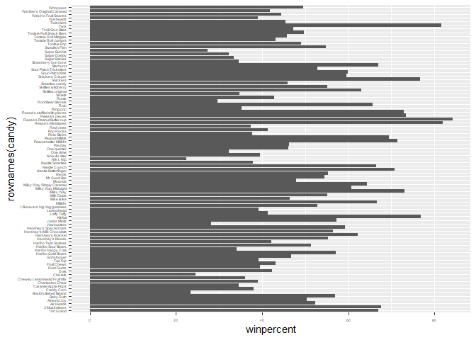
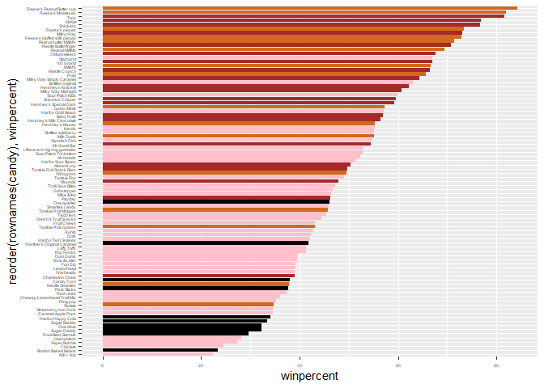

lab10: Halloween Mini Project
================
Ethan Ashley (PID: A15939817)
2025-10-31

- [Importing the 538 Candy Popularity
  Dataset](#importing-the-538-candy-popularity-dataset)
- [What is your favorite candy?](#what-is-your-favorite-candy)
- [Overall Candy Rankings](#overall-candy-rankings)
- [Taking a look at pricepercent](#taking-a-look-at-pricepercent)
- [Exploring the correlation
  structure](#exploring-the-correlation-structure)
- [Principal Component Analysis](#principal-component-analysis)

# Importing the 538 Candy Popularity Dataset

``` r
candy_file <- "candy-data.csv"

candy = read.csv(candy_file, row.names = 1)

#head(candy)
```

**Q1. How many different candy types are in this dataset?**

There are 85 different types of candy.

``` r
nrow(candy)
```

    ## [1] 85

**Q2. How many fruity candy types are in the dataset?**

There are 38 fruity candy types in the dataset.

``` r
sum(candy$fruity)
```

    ## [1] 38

# What is your favorite candy?

**Q3. What is your favorite candy in the dataset and what is it’s
winpercent value?**

My favorite candy in the dataset is M&M’s. The win percent for M&M’s is
66.6%.

``` r
candy["M&M's", ]$winpercent
```

    ## [1] 66.57458

**Q4. What is the winpercent value for “Kit Kat”?**

The winpercent value for Kit Kat is 76.8%.

``` r
candy["Kit Kat", ]$winpercent
```

    ## [1] 76.7686

**Q5. What is the winpercent value for “Tootsie Roll Snack Bars”?**

The winpercent value for Tootsie Roll Snack Bars is 49.7.

``` r
candy["Tootsie Roll Snack Bars", ]$winpercent
```

    ## [1] 49.6535

*`skim(candy)` could not be included because of a unicode support error
with installation of TinyTex/Latex*

``` r
library("skimr")
#skim(candy)
```

**Q6. Is there any variable/column that looks to be on a different scale
to the majority of the other columns in the dataset?**

The winpercent column seems to be on a different scale than the other
columns in the dataset.

**Q7. What do you think a zero and one represent for the
candy\$chocolate column?**

I think zero and one represent whether a candy has chocolate or not.

**Q8. Plot a histogram of winpercent values**

``` r
library(ggplot2)

ggplot(candy) + aes(winpercent) + geom_histogram(bins = 15)
```

<!-- -->

**Q9. Is the distribution of winpercent values symmetrical?**

The distribution of winpercent values is not symmetrical.

``` r
ggplot(candy) + aes(winpercent) + geom_density()
```

<!-- -->

**Q10. Is the center of the distribution above or below 50%?**

The center of the distribution appears to be below 50%.

``` r
summary(candy$winpercent)
```

    ##    Min. 1st Qu.  Median    Mean 3rd Qu.    Max. 
    ##   22.45   39.14   47.83   50.32   59.86   84.18

**Q11. On average is chocolate candy higher or lower ranked than fruit
candy?**

On average chocolate candy is higher ranked than fruity candy.

``` r
chocWinPercent <- candy$winpercent[as.logical(candy$chocolate)]
fruityWinPercent <- candy$winpercent[as.logical(candy$fruity)]

mean_chocWinPerecent <- mean(chocWinPercent)
mean_fruityWinPercent <- mean(fruityWinPercent)

mean_chocWinPerecent > mean_fruityWinPercent
```

    ## [1] TRUE

**Q12. Is this difference statistically significant?**

Using a T-test, the difference is statistically significant.

``` r
t.test(chocWinPercent, fruityWinPercent)
```

    ## 
    ##  Welch Two Sample t-test
    ## 
    ## data:  chocWinPercent and fruityWinPercent
    ## t = 6.2582, df = 68.882, p-value = 2.871e-08
    ## alternative hypothesis: true difference in means is not equal to 0
    ## 95 percent confidence interval:
    ##  11.44563 22.15795
    ## sample estimates:
    ## mean of x mean of y 
    ##  60.92153  44.11974

# Overall Candy Rankings

**Q13. What are the five least liked candy types in this set?**

The five least liked candies in this set are Nik L Nip, Boston Baked
Beans, Chiclets, Super Bubble, and Jawbusters.

``` r
library(dplyr)
```

    ## 
    ## Attaching package: 'dplyr'

    ## The following objects are masked from 'package:stats':
    ## 
    ##     filter, lag

    ## The following objects are masked from 'package:base':
    ## 
    ##     intersect, setdiff, setequal, union

``` r
candy %>% arrange(winpercent) %>% head(5)
```

    ##                    chocolate fruity caramel peanutyalmondy nougat
    ## Nik L Nip                  0      1       0              0      0
    ## Boston Baked Beans         0      0       0              1      0
    ## Chiclets                   0      1       0              0      0
    ## Super Bubble               0      1       0              0      0
    ## Jawbusters                 0      1       0              0      0
    ##                    crispedricewafer hard bar pluribus sugarpercent pricepercent
    ## Nik L Nip                         0    0   0        1        0.197        0.976
    ## Boston Baked Beans                0    0   0        1        0.313        0.511
    ## Chiclets                          0    0   0        1        0.046        0.325
    ## Super Bubble                      0    0   0        0        0.162        0.116
    ## Jawbusters                        0    1   0        1        0.093        0.511
    ##                    winpercent
    ## Nik L Nip            22.44534
    ## Boston Baked Beans   23.41782
    ## Chiclets             24.52499
    ## Super Bubble         27.30386
    ## Jawbusters           28.12744

**Q14. What are the top 5 all time favorite candy types out of this
set?**

The top 5 most popular candies are in this set are Reese’s Peanut Butter
Cups, Reese’s Miniatures, Twix, Kit Kat, and Snickers.

``` r
candy %>% arrange(desc(winpercent)) %>% head(5)
```

    ##                           chocolate fruity caramel peanutyalmondy nougat
    ## Reese's Peanut Butter cup         1      0       0              1      0
    ## Reese's Miniatures                1      0       0              1      0
    ## Twix                              1      0       1              0      0
    ## Kit Kat                           1      0       0              0      0
    ## Snickers                          1      0       1              1      1
    ##                           crispedricewafer hard bar pluribus sugarpercent
    ## Reese's Peanut Butter cup                0    0   0        0        0.720
    ## Reese's Miniatures                       0    0   0        0        0.034
    ## Twix                                     1    0   1        0        0.546
    ## Kit Kat                                  1    0   1        0        0.313
    ## Snickers                                 0    0   1        0        0.546
    ##                           pricepercent winpercent
    ## Reese's Peanut Butter cup        0.651   84.18029
    ## Reese's Miniatures               0.279   81.86626
    ## Twix                             0.906   81.64291
    ## Kit Kat                          0.511   76.76860
    ## Snickers                         0.651   76.67378

**Q15. Make a first barplot of candy ranking based on winpercent
values.**

``` r
ggplot(candy) + aes(winpercent, rownames(candy)) + geom_col() + theme(axis.text=element_text(size=4))
```

<!-- -->

**Q16. This is quite ugly, use the reorder() function to get the bars
sorted by winpercent?**

``` r
ggplot(candy) + aes(winpercent, reorder(rownames(candy),winpercent)) + geom_col() + theme(axis.text=element_text(size=4))
```

<!-- -->

``` r
my_cols=rep("black", nrow(candy))
my_cols[as.logical(candy$chocolate)] = "chocolate"
my_cols[as.logical(candy$bar)] = "brown"
my_cols[as.logical(candy$fruity)] = "pink"

ggplot(candy) + 
  aes(winpercent, reorder(rownames(candy),winpercent)) +
  geom_col(fill=my_cols) + theme(axis.text=element_text(size=4))
```

<!-- -->

**Q17. What is the worst ranked chocolate candy?**

The worst ranked chocolate candy is Sixlets.

**Q18. What is the best ranked fruity candy?**

The best ranked fruit candy is Starbursts.

# Taking a look at pricepercent

``` r
library(ggrepel)

# How about a plot of price vs win
ggplot(candy) +
  aes(winpercent, pricepercent, label=rownames(candy)) +
  geom_point(col=my_cols) + 
  geom_text_repel(col=my_cols, size=3.3, max.overlaps = 5)
```

    ## Warning: ggrepel: 54 unlabeled data points (too many overlaps). Consider
    ## increasing max.overlaps

<!-- -->

**Q19. Which candy type is the highest ranked in terms of winpercent for
the least money - i.e. offers the most bang for your buck?**

The candy type that is highest ranked for the best price is Reese’s
Miniatures.

**Q20. What are the top 5 most expensive candy types in the dataset and
of these which is the least popular?**

The top 5 most expensive candy types are Nik L Nip, Nestle Smarties,
Ring pop, Hershey’s Krackel, and Hershey’s Milk Chocolate.

The least popular of these candies is Nik L Nip.

``` r
candy %>% arrange(desc(candy$pricepercent)) %>% head(5)
```

    ##                          chocolate fruity caramel peanutyalmondy nougat
    ## Nik L Nip                        0      1       0              0      0
    ## Nestle Smarties                  1      0       0              0      0
    ## Ring pop                         0      1       0              0      0
    ## Hershey's Krackel                1      0       0              0      0
    ## Hershey's Milk Chocolate         1      0       0              0      0
    ##                          crispedricewafer hard bar pluribus sugarpercent
    ## Nik L Nip                               0    0   0        1        0.197
    ## Nestle Smarties                         0    0   0        1        0.267
    ## Ring pop                                0    1   0        0        0.732
    ## Hershey's Krackel                       1    0   1        0        0.430
    ## Hershey's Milk Chocolate                0    0   1        0        0.430
    ##                          pricepercent winpercent
    ## Nik L Nip                       0.976   22.44534
    ## Nestle Smarties                 0.976   37.88719
    ## Ring pop                        0.965   35.29076
    ## Hershey's Krackel               0.918   62.28448
    ## Hershey's Milk Chocolate        0.918   56.49050

# Exploring the correlation structure

``` r
library(corrplot)
```

    ## corrplot 0.95 loaded

``` r
cij <- cor(candy)
corrplot(cij)
```

<!-- -->

**Q22. Examining this plot what two variables are anti-correlated
(i.e. have minus values)?**

The chocolate and fruity variables are anti-correlated.

**Q23. Similarly, what two variables are most positively correlated?**

The two most positively correlated variables are chocolate and
winpercent.

# Principal Component Analysis

``` r
pca <- prcomp(candy, scale = TRUE)
summary(pca)
```

    ## Importance of components:
    ##                           PC1    PC2    PC3     PC4    PC5     PC6     PC7
    ## Standard deviation     2.0788 1.1378 1.1092 1.07533 0.9518 0.81923 0.81530
    ## Proportion of Variance 0.3601 0.1079 0.1025 0.09636 0.0755 0.05593 0.05539
    ## Cumulative Proportion  0.3601 0.4680 0.5705 0.66688 0.7424 0.79830 0.85369
    ##                            PC8     PC9    PC10    PC11    PC12
    ## Standard deviation     0.74530 0.67824 0.62349 0.43974 0.39760
    ## Proportion of Variance 0.04629 0.03833 0.03239 0.01611 0.01317
    ## Cumulative Proportion  0.89998 0.93832 0.97071 0.98683 1.00000

``` r
plot(pca$x[,1:2])
```

<!-- -->

``` r
plot(pca$x[,1:2], col=my_cols, pch=16)
```

<!-- -->

``` r
# Make a new data-frame with our PCA results and candy data
my_data <- cbind(candy, pca$x[,1:3])

p <- ggplot(my_data) + 
        aes(x=PC1, y=PC2, 
            size=winpercent/100,  
            text=rownames(my_data),
            label=rownames(my_data)) +
        geom_point(col=my_cols)

p
```

<!-- -->

``` r
p + geom_text_repel(size=3.3, col=my_cols, max.overlaps = 7)  + theme(legend.position = "none") + labs(title="Halloween Candy PCA Space", subtitle="Colored by type: chocolate bar (dark brown), chocolate other (light brown), fruity (red), other (black)", caption="Data from 538")
```

    ## Warning: ggrepel: 43 unlabeled data points (too many overlaps). Consider
    ## increasing max.overlaps

<!-- -->

**plotly element was not run in the final report because it could not be
rendered into pdf**

``` r
library(plotly) #useful for producing interactive plots that can be integrated in html outputs
```

    ## 
    ## Attaching package: 'plotly'

    ## The following object is masked from 'package:ggplot2':
    ## 
    ##     last_plot

    ## The following object is masked from 'package:stats':
    ## 
    ##     filter

    ## The following object is masked from 'package:graphics':
    ## 
    ##     layout

``` r
#ggplotly(p)
```

``` r
par(mar=c(8,4,2,2))
barplot(pca$rotation[,1], las=2, ylab="PC1 Contribution")
```

<!-- -->

**Q24. What original variables are picked up strongly by PC1 in the
positive direction? Do these make sense to you?**

The variables fruity, hard, and, pluribus are picked up strongly in PC1.
These make sense to me, most people don’t prefer harder, fruit flavored
candies.
